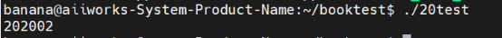
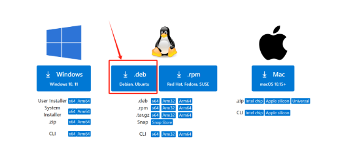
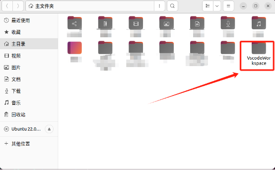
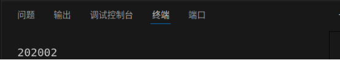

# 附录
# Linux下学习C++20
# **附录1：Linux下学习C++20**

## **一、Ubuntu 22.04.5 使用g++ 运行C++20 程序**

在尝试了vscode、msvc编译C++20的程序之后，我发现在windows系统下配置的支持C++20的编译环境不是很稳定，达不到理想的状态，于是我们就简单的使用Ubuntu来编译我们的C++代码。下图是Ubuntu的版本：


注意：这里的Ubuntu版本必须是 Ubuntu 22.04.5（或更高）版本，否则不支持C++20标准。

要想在Ubuntu中运行C++代码，我们就需要借助linux中的工具了，我们使用的是g++，版本为


安装步骤如下：
```bash
sudo apt install build-essential 
```
使用 apt 包管理工具以超级用户身份安装 build-essential 包。build-essential 是一个包含编译软件时所需的基本工具（如 GCC 编译器、make 工具等）的元包。
```
sudo apt-get dist-upgrade --fix-missing
```
使用 apt-get 执行升级操作，dist-upgrade 将更新已安装的包，并处理依赖关系变化。--fix-missing 选项会在遇到缺失包时尝试修复它们。
```
sudo apt install build-essential
```
再次安装 build-essential，可能是因为之前的命令未能成功完成。
```
sudo add-apt-repository ppa:ubuntu-toolchain-r/test
```
添加一个第三方软件源（PPA），该 PPA 提供更新的工具链（如编译器）。
```
sudo apt install gcc-13
```
安装 GCC 版本 13 编译器。
```
sudo apt install g++-13
```
安装 G++ 版本 13，这是一种 C++ 编译器，与 GCC 配合使用。
```
sudo update-alternatives --install /usr/bin/gcc gcc /usr/bin/gcc-11 11
```
使用 update-alternatives 配置系统使用的 GCC 版本，将 GCC 11 加入选择列表，并指定其优先级为 11。
```
sudo update-alternatives --install /usr/bin/gcc gcc /usr/bin/gcc-13 13
```
将 GCC 13 加入选择列表，并将其优先级设置为 13，这意味着它将被默认选择（即使有多个版本）。
```
sudo update-alternatives --install /usr/bin/g++ g++ /usr/bin/g++-11 11
```
添加 G++ 11 到 update-alternatives 的选择列表，优先级为 11。
```
sudo update-alternatives --install /usr/bin/g++ g++ /usr/bin/g++-13 13
```
添加 G++ 13 到选择列表，并设置优先级为 13。

接下来，我们稍微验证一下我们的环境，并测试一下是不是真的支持C++20标准。
```
  #include <iostream>
  #include<vector>
  using namespace std;
  int main()
  {
  /**
   * __cplusplus是用来标识所使用C++标准版本的预定义宏
   * 对于C++11，会返回201103
   * 对于C++17，会返回201703
   * 对于C++20，会返回202002
   */
 cout << __cplusplus << endl;
  }
```
根据这段代码的注释就可以很简单的明白测试的原理了吧。



## **二、Ubuntu 22.04.5 使用vscode运行C++20程序**

1、在Ubuntu 22.04.5上安装vscode

（1）下载安装包

进入官网：[https://code.visualstudio.com/Download](https://code.visualstudio.com/Download) ，下载下面的文件：



（2）打开Terminal，键入命令：
```
sudo dpkg -i [刚刚下载的文件名]
```
（3）安装完成后，打开vscode：

在命令行中输入 code 即可打开

（4）新建文件夹，在home（如果是中文界面，就是在主目录）下新建文件夹，为vscode的工作空间。



（5）在vscode的左上角，文件 à 打开文件夹 à 选择新建的文件夹 à 选择信任 即可

（6）新建一个helloworld文件，键入下面的代码，运行检查是否支持C++20
```
 #include <iostream>
  #include<vector>
  using namespace std;
  int main()
  {
  /**
   * __cplusplus是用来标识所使用C++标准版本的预定义宏
   * 对于C++11，会返回201103
   * 对于C++17，会返回201703
   * 对于C++20，会返回202002
   */
  cout << __cplusplus << endl;
  }
```
（7）运行，得到验证



注意：
如果你使用的非desktop版本的Ubuntu，那么请看下面的教程：

1. 下载VSCode的.deb文件 你可以使用wget直接下载VSCode的.deb安装包：
```
wget https://update.code.visualstudio.com/latest/linux-deb-x64/stable -O vscode.deb
```
1. 安装.deb文件 使用dpkg安装下载的.deb文件：
```
sudo dpkg -i vscode.deb
```
1. 安装依赖（如果有缺少依赖的错误） 如果在安装过程中遇到依赖性问题，运行以下命令来解决：
```
sudo apt *--fix-broken install*
```
1. 检查VSCode安装 验证安装是否成功：
```
code *--version*
```
如果出现版本信息，就说明已经安装成功了。

