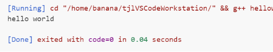

# 引言

C++20第一个程序:Helloworld

刚开始接触编程时，无论是学C++，还是Java、Python、C。第一个入门程序都是Helloworld，，实现在控制台打印一个“hello world”。C++20是 C++ 语言一次非常重大的更新，里面加入了四个新特性：概念、范围、协程和模块，以及一些核心语言。这篇文章将会从Helloworld开始带你走进C++20的世界。

1. 代码
```
// helloworld.cpp*
#include <iostream>;
int main(){
std::cout <<"Hello,World!"<< std: :endl;
return 0;
}
```
  运行结果为：



1. 知识分析
   
   1\.注释
   
   第一行：`// helloworld.cpp是一个注释行。`
   
   在 C++ 中，注释是用来解释代码的文本，它们对程序的编译和执行没有影响。C++ 提供了两种主要的注释方式：单行注释和多行注释。
   
   **单行注释**：使用两个斜杠//标记。编译器会忽略从//开始到该行末尾的文本。单行注释通常用于对代码行或代码块进行简短的说明。例如：
   
   **多行注释** ：也称为块注释，使用 /\* 开始和 \*/ 结束。这种注释可以跨越多行，用于解释复杂的代码段或提供详细的信息。在 /\* 和 \*/ 之间的所有内容都将被编译器忽略。
```
 #include <iostream>;
 int main()
 {
std::cout <<"单行注释"<< std: :endl;*//这是一个单行注释，不可以跨行*
/**
这是一个多行注释
可以跨越多行
*/
std::cout <<"多行注释"<< std: :endl;
return 0;
}
```
2\.模块导入

`#include <iostream>;`

这是一条模块导入代码。

在C++20中，如果你想要使用某个模块中的功能，则需要导入这个模块。这是通过一条include声明做到的。Hello World小程序的第一行导入了名为<iostream>的模块，它声明了C++提供的输入输出机制。

- C++标准库是一个庞大而全面的库，它包含了众多用于各种编程任务的类和函数。这些库旨在提高C++程序的开发效率和可重用性。
- C++标准库被组织成多个部分，包括但不限于算法、容器、迭代器、字符串处理、I/O（输入/输出）流、时间处理、本地化支持等。
- C++标准库提供的所有功能都在定义好的模块中。你自定义的类型和函数也可以通过模块提供。

- C++标准库与输入输出流库的关系：

`iostream`（输入输出流）库是C++标准库中的一个重要组成部分，它专门用于处理输入和输出操作。iostream库提供了一系列用于输入输出的类和对象，比如：cin（用于从标准输入读取数据）、cout（用于向标准输出写入数据）和cerr（用于向标准错误输出写入数据）。简而言之，iostream库是C++标准库的一个子集，专门用于处理输入和输出任务。

3. `main()函数`
   
   函数是C++程序的重要组成部分之一，它负责实现一些指定的功能。通常函数包括返回值、返回值类型、函数名、形式参数、函数体。基本结构为：
   ```
   返回值类型 函数名（形式参数）
   
   {
   
   代码
   
   return 返回值；
   
   }
   ```
   其中大括号包含的所有组成了函数体。函数体主要描述了这个函数会做什么事。返回值可以被函数调用者接受，并且返回值的数据类型必须要与返回值类型一致或相容（具体将在后面章节讲述）。
   
   无论是在`C/C++`还是`Java`中，`main`函数/方法都是程序执行的起点。它负责初始化程序所需的环境，并调用其他函数/方法以执行程序的其余部分。
   
   C++20中，main()函数返回一个int值以指示程序的最终执行状态。在main()函数中，可以忽略显式的return语句，这种情况下会自动返回0。main()函数要么没有参数，要么具有两个参数，如下所示:
   
   int main (int argc, char\* argv[])
   
   argc 给出了传递给程序的实参数目，argv包含了这些实参。注意argv[0]可能是程序的名称，也可能是空字符串，所以不应使用它。相反，应当使用特定于平台的功能检索程序名。重要的是要记住,实际参数从索引1开始。

4\.输入输出流

输出流——针对数据的滑槽，放入其中的任何内容都可以被正确地输出。std::cout就是对应于用户控制台或标准输出的滑槽，此外还有其他滑槽，包括用于输出错误信息的std::cerr。

<<运算符将数据放入滑槽，在前面的示例中，引号中的文本字符串被送到标准输出。

我们使用的cout、endl都属于C++标准库，C++标准库都放在一个名为std的命名空间中，所以要通过命名空间的使用方式去用他们，即命名空间名::。

输出流可在一行代码中连续输出多个不同类型的数据。
```
#include <iostream>;
 int main()
 {
std::cout <<"There are "<<219 <<" ways I love you."<<std::endl;
return 0;
 }
```
输出结果There are 219ways I love you.

推荐的写法是使用std::format()，它定义在<forma>中，用来格式化字符串。
```
 #include <iostream>;
 int main()
 {
std::cout << std::format("There are()ways I love you.",219)<<std::endl;
return 0;
 }
```
输出结果是`There are 219 ways I love you.`

std::endl代表序列的结尾。当输出流遇到std::endl时，就会将已送入滑槽的所有内容输出并转移。

