## **3.1 循环**

### **3.1.1 理解循环**

在使用计算机编程处理数学问题时，我们经常遇到需要重复进行的操作。比如求等差数列的和、求阶乘等。为解决以上问题，我们引入一种可以重复执行某一段代码块的过程，并将此过程称之为循环。循环包括两个基本要素：循环体（要重复执行的语句或语句块）、循环条件（决定何时停止重复循环），循环体每执行一次则称为一次迭代。C++中常见的循环形式由while，do-while以及for循环三种。

### **3.1.2 while循环**

While循环在每次执行前都要检查循环条件是否为真，若不为真则跳出循环。流程图及其语法格式如下所示：
```
 while (condition) *//此处的condition为循环条件，每次执行前都要先判断是否为真*
 {
 //此处添加需要重复执行的内容，即循环体*
 }
```


图1  while循环流程图

我们可以通过一个经典的问题——猜数字问题来进一步理解while循环的使用方法：在本游戏中，计算机每一次都会随机产生一个[0,99]之间的数字。玩家共有五次机会，每一次均可输入一个数字作为猜测结果，若当五次机会全部耗尽后依然没猜中记为游戏失败。下面我们在Ubuntu系统下，采用VSCode将此问题代码表示出来:
```
#include <iostream>  
#include <cmath>  
#include <cstdlib> // 需要读取 rand() 相关内容  
#include <ctime>   // 需要用于随机数种子  

using namespace std;  

int main()  
{  
    srand(static_cast<unsigned int>(time(0))); // 设置随机数种子  
    
    int num = rand() % 100; // 生成0到99之间的随机数  
    int count = 0;  
    int guess;  

    while (count < 5)  
    {  
        cout << "please enter the number you guess: ";  
        cin >> guess;  

        if (guess > num)  
        {  
            cout << "too big!" << endl;  
        }  
        else if (guess < num)  
        {  
            cout << "too small!" << endl;  
        }  
        else  
        {  
            cout << "congratulations!" << endl;  
            break;  
        }  
        count++;  
    }  

    if (count == 5)  
    {  
        cout << "you failed" << endl;  
    }  

    return 0;  
}
```
运行这段程序，结果如下图所示，至此我们便初步掌握了利用while循环编写简单程序的方法。

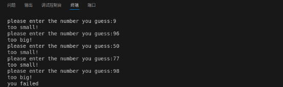

图2 采用while循环编写猜数字游戏运行结果

### **3.1.3 do-while循环**

Do-while循环要先执行一次循环体中的代码块，随后检查循环条件是否为真，若为真便继续执行，流程图及其语法格式如下所示：
```
 do
 {
/* 循环体 */
} while (/* 循环条件 */);
```
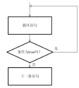

图3 do-while循环流程图

我们将介绍一段计算平均温度的代码，以此来说明do-while循环的应用场景。下面将给出该程序的代码：
```
#include <iostream>  
#include <format>  
#include <cctype>  

using namespace std;  

int main() {  
    char reply {};  
    int count {};  
    double sum {};  

    do {  
        double temperature;  
        cout << "Enter a temperature reading: ";  
        cin >> temperature;  

        sum += temperature;  // 累加温度  
        count++;  

        cout << "Do you want to continue? (y/n): ";  
        cin >> reply;  
    } while (tolower(reply) == 'y');  // 判断是否继续  

    cout << format("The average temperature is {}.\n", sum / count);  // 输出平均温度  
    return 0;  
}
```
因为循环条件是reply=y，而用户在每次迭代中才会给出reply的值。故循环必须运行至少一次，因此采用do-while循环。运行这段程序，结果如下图所示：


图4 采用do-while循环编写平均温度计算程序运行结果

### **3.1.4 for循环**

For循环为一种计数循环，主要用于对语句或语句块执行预知的次数。可以用以分号分隔的三个表达式来控制for循环，第一个表达式用于初始化一个容器，第二部表达式用于检查计数器是否达到给定的极限，第三个表达式用于递增这个计数器。这三个表达式任一一个都可以省略，但分号必须有。流程图及其语法格式如下所示：
```
 for(初始化；条件；迭代)
 {
//循环体
 }
```
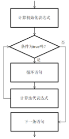

图5 for循环流程图

当循环体中只有一条语句时，也可不加花括号，但要保证正常缩进：
```
for(初始化；条件；迭代)
//循环体
```
同时，我们应注意到，在for循环的初始化表达式中定义变量时，该变量的作用范围只有for循环下面的花括号，循环结束，该变量便不复存在。

为更深刻地理解for循环的使用方法，我们来看如下问题：现在进行敲桌子游戏，在[1,100]范围内的所有整数中，如果一个数是7的倍数或十位有7或个位有7，则认定该数字为特殊数字，同时输出敲桌子，否则便输出数字本身。以下给出该问题的代码供参考：
```
#include <iostream>  
#include <cmath>  

using namespace std;  

int main() {  
    for (int i = 1; i <= 100; i++) {  
        if (i % 7 == 0 || i / 10 == 7 || i % 10 == 7) {  
            cout << "knock knock" << endl; // 输出 "knock knock"  
        } else {  
            cout << i << endl; // 输出当前数字  
        }  
    }  
    return 0;  
}
```
运行此程序，部分结果如下所示：

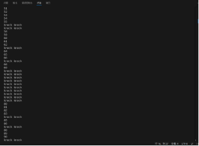

图6 采用for循环编写的敲桌子游戏运行结果

### **3.1.5 浮点数控制for循环**

我们需要认识到，for循环不仅能用整数控制，也可以用小数控制。但此时我们应当注意，因为小数部分的值可能无法被二进制浮点数精确地表示，这可能会对程序带来一些意想不到的负面效应。我们来分析以下程序：
```
#include <iostream>  

using namespace std;  

int main() {  
    for (double i { 0.2 }; i <= 3.0; i += 0.2) {  
        cout << i << ' ';  // 输出当前的 i  
    }  
    return 0;  
}
```
我们也许会认为这段程序的输出结果会是一个从0.2到3.0，公差为0.2的等差数列，但实际上输出结果却是从0.2到2.8的数列，如图7所示。

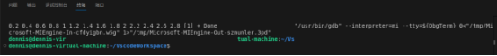

图7 数列输出结果

出现这个问题的原因就在于在把0.2表示为浮点数时，在精度的最后一位上会出现偏差。而这微小的偏差就导致了把这样的0.2与2.8相加时，其结果反而大于3.0，循环终止。采用如下代码分析误差：
```
#include <iostream>  
#include <format>  
#include <cctype>  

using namespace std;  

int main() {  
    for (double i = 0.2; i <= 3.0; i += 0.2) {  
        cout << format("delta to 3 is {}\n", i + 0.2 - 3.0);  
    }  
    cout << endl;  
    return 0;  
}
```
我们发现，当i=2.8时，为它加上0.2随后对3作差的结果并不是0，而是一个小量，所以循环便被终止了，无法输出3.0。如下图所示：

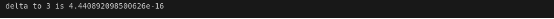

图8  对3作差结果

而当我们把循环执行条件改为i<=3.0+0.001时，就可以得到正确的输出结果，如图9所示。因此，无法精确表示浮点变量有时会给程序带来一些意想不到的错误，为解决这种问题，可以将循环终止条件改为类似于i-3.0<=0.001这种形式。

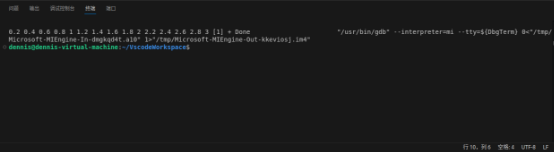

图9 正确数列输出结果

### **3.1.6 基于范围的for循环**

若采用传统的循环来遍历数组，由程序员来说明循环的范围容易出现数组越界等错误。因此，在C++20中针对传统的for循环进行了修改，引入了std::ranges库，因此，我们可以尝试采用基于范围的for循环。范围可以是数组、字符串，也可以是标准库提供的容器。在使用前首先需要导入该库，如下所示：

#include<ranges>

随后我们采用array来定义一个数组，与普通数组不同的是，array类型中提供了一系列的内置函数用于对数组进行操作（详见下一章），其定义语法为array<元素数据类型，数组长度> 数组名。

然后我们便可以针对定义好的数组，采用基于范围的for循环方式进行遍历，在该种遍历方式中，for循环后的括号被冒号一分为二，前一部分为可选的初始化部分（**C++20的新功能，需要补充C++20和其它版本的对比）和**用于迭代的变量，此变量每一次迭代的时候都会被赋予范围内的一个新值，后一部分为迭代的范围。其与其它C++版本的格式对比以及语法格式如下所示：


1. for([初始化语句;]用于迭代的变量:迭代的范围)

比如，我们要遍历myArray数组，并把它的每一个元素存放在value中输出，那么我们可以用for(int value:myArray)来执行上述操作。

下面给出完整代码：
```
#include <iostream>  
#include <array>  

using namespace std;  

int main() {  
    array<int, 5> myArray = {1, 2, 3, 4, 5}; // 定义一个数组并初始化  
    for (int value : myArray) { // 使用范围基 for 循环遍历数组  
        cout << value << " "; // 输出当前值  
    }  
    cout << endl; // 输出换行  
    return 0;  
}
```
  运行本段代码，结果如图10所示，可以看到，myArray数组被成功遍历：

  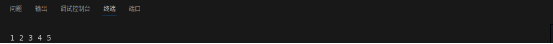

  图10 采用基于范围的for循环遍历array类型数组的结果

### **3.1.7 采用for\_each遍历数组**

在C++20中，for\_each也是遍历数组的一种方式。使用时需要先引入algorithm、ranges两个头文件，语法格式如下所示：
```
 ranges::for\_each(数组名,[](迭代变量数据类型 迭代变量{
//循环体
}));
```
现假设我们需遍历myArray数组，并将其中每个元素放在value中输出，则该循环可以写作
```
ranges::for\_each(myArray,  [](int value{

//此处输出value的值即可

});
```
下面给出完整代码：
```
#include <iostream>  
#include <array>  
#include <ranges>  
#include <algorithm>  

using namespace std;  

int main() {  
    array<int, 5> myArray = {1, 2, 3, 4, 5}; // 定义并初始化数组  

    // 使用 ranges::for_each 和 Lambda 表达式遍历数组  
    ranges::for_each(myArray, [](int value) {  
        cout << value << " "; // 输出当前值  
    });  

    cout << endl; // 输出换行  
    return 0;  
}
```
运行上述代码，结果如图7所示，可以看到数组被成功遍历。

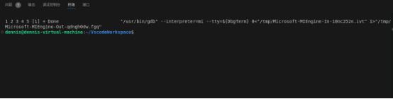

图7 采用std::ranges::for\_each遍历数组的结果

### **3.1.8 嵌套循环**

有时我们可以把一个循环放在另一个循环的内部，并且嵌套的循环可以是任何类型——在while循环中嵌套for循环，再把while循环嵌套进do-while循环中，最后把do-while循环嵌套在基于范围的for循环中。它们能以任何方式混合在一起。

这些嵌套循环经常用于多维数组的遍历，但也会有其它用途。下面我们来看一个例子：乘法表是许多孩子在学校的必修课，可以利用嵌套循环来生成一个乘法表，代码如下所示：
```
#include <iostream>  
#include <format>  
#include <cctype>  

using namespace std;  

int main() {  
    size_t table {};  
    const size_t table_min {2};  
    const size_t table_max {12};  
    char reply {};  

    do {  
        cout << format("What size table would you like ({} to {})? ", table_min, table_max);  
        cin >> table;  
        cout << endl;  

        if (table < table_min || table > table_max) {  
            cout << "Invalid table size entered. Program terminated." << endl;  
            return 1;  
        }  

        cout << format("{:6}", '|');  
        for (size_t i {1}; i <= table; i++) {  
            cout << format(" {:3} |", i);  
        }  
        cout << endl;  

        for (size_t i {}; i <= table; i++) {  
            cout << "------";  
        }  
        cout << endl;  

        for (size_t i {1}; i <= table; i++) {  
            cout << format(" {:3} |", i);  
            for (size_t j {1}; j <= table; j++) {  
                cout << format(" {:3} |", i * j);  
            }  
            cout << endl;  
        }  

        cout << "\nDo you want another table (y or n)? ";  
        cin >> reply;  

    } while (tolower(reply) == 'y');  

    return 0;  
}
```
在上面的例子中，我们将乘法尺寸表的输入值存储在table中，乘法表中包含从1×1到table×table的所有乘积。并且我们要检查输入的table值是否处于有效范围内，如果在则返回1（第23行）。该乘法表以矩阵的形式显示，我们首先采用一个for循环创建行，随后在其内部嵌套一个for循环用以输出乘积。嵌套循环每执行一次，就生成一行。运行结果如下图所示：

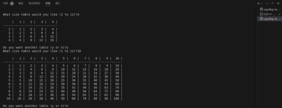

图8 嵌套循环生成乘法表结果

### **3.1.9 循环中断**

我们有时需提前终止循环。当循环没有必要执行下去时，我们可以使用break语句结束循环，程序继续执行后面语句。break在无限循环中经常使用。

首先我们来介绍无限循环的编写，有如下几种形式：
```
 for(;;)
{
*//循环体*
 {
 while(true)
 {
//循环体
 {
```
下面我们将给出一个按升序对数组内容进行排序的例子，用以进一步说明break语句的用法。代码如下所示：
```
#include <iostream>  
#include <cmath>  
#include <cstdlib> // 需要读取 rand() 相关内容  
#include <ctime>   // 需要用于随机数种子  

using namespace std;  

int main()  
{  
    srand(static_cast<unsigned int>(time(0))); // 设置随机数种子  
    
    int num = rand() % 100; // 生成0到99之间的随机数  
    int count = 0;  
    int guess;  

    while (count < 5)  
    {  
        cout << "please enter the number you guess: ";  
        cin >> guess;  

        if (guess > num)  
        {  
            cout << "too big!" << endl;  
        }  
        else if (guess < num)  
        {  
            cout << "too small!" << endl;  
        }  
        else  
        {  
            cout << "congratulations!" << endl;  
            break;  
        }  
        count++;  
    }  

    if (count == 5)  
    {  
        cout << "you failed" << endl;  
    }  

    return 0;  
}
```
数据在第一个while循环中被读入，若读入的数字为0，则认为读入结束，通过break退出循环，若不为0，则将输入的值存入索引为count的数组元素中。若数组中的元素数量到了最大容量，那也要通过break退出输入循环。第二个while循环将输入的数字按照升序排序，布尔变量swapped记录了执行for循环时是否需要交换元素值，若不需要便是已经排序好，直接通过break退出循环，若需要，便交换顺序不对的元素。这种排序方法称为冒泡排序。运行结果如下所示：

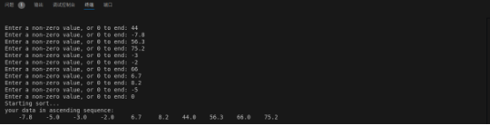

图9 冒泡排序程序运行结果

另外从无符号整数中减去一个值时要特别小心，任何负数将被转化成一个极大的整数，从而导致程序崩溃。所以循环进行条件可以改为i<static\_cast<int>(count)-1。

**3.1.10 跳过循环迭代**

有时需要跳过循环迭代，直接开始下一次循环。可以使用continue语句来完成这一操作。形式如下所示：
```
continue;
```
在循环中执行到该语句时，程序会跳到当前阶段的末尾。只要循环控制表达式允许就会立即进行下一次迭代。下面我们将给出一个例子，用以更明确地说明其用法。
