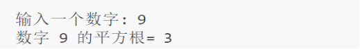

## **4.1 内置函数**

我们所说的内置函数其实就是C++编译器自带的函数，它不需要用户来编写，取之即用。常见的内置函数包括数学函数、字符串函数、类型转换函数等。例如，sin()函数用于计算正弦值，strlen()函数用于计算字符串的长度等。这些函数都属于C++的标准库函数，因此在程序中无需显式包含相应的头文件即可直接使用。
```
#include <iostream>
#include <cmath>
using namespace std;
int main()
{
double number, squareRoot;
cout << "输入一个数字: ";
cin >> number; // sqrt()是一个用于计算平方根的库函数*
squareRoot = sqrt(number);
cout << "数字 " << number << " 的平方根= " << squareRoot << "\n";
return 0;
}
```
输出结果为：


在上面的示例中，调用sqrt()库函数来计算数字9的平方根。

上述程序中的注意代码#include <cmath>。 在这里cmath是头文件。sqrt()函数定义在cmath头文件中。当你使用#include <cmath>将文件cmath的内容包含到这个程序中时，您可以在这个程序中使用cmath中定义的所有函数。此外需要注意的是，每个有效的C ++程序至少具有一个函数，即main()函数。