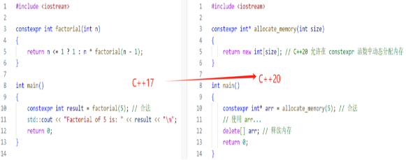
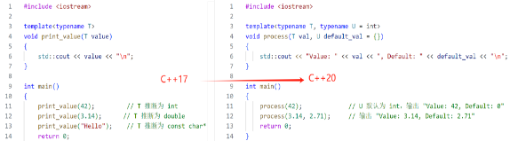
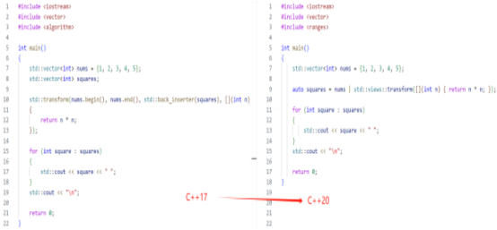
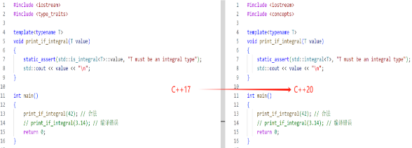

## **4.9 C++20函数新变化**

除此之外，需要值得注意的是C++20中函数的内容做出了一些新的变化，比如C++20中放宽了constexpr函数使用更多特性、引入了consteval关键字、改进模板参数，提供更灵活的模板参数定义，支持推断模板参数、引入concepts等等，下面我们一起来学习这些内容：

### **4.9.1 constexpr 函数的扩展**

在 C++17 中，constexpr 函数有一定的限制，例如不能使用动态内存分配。而在 C++20 中，这些限制被放宽，允许 constexpr 函数使用更多特性。



### **4.9.2 consteval 函数的引入**

C++20 引入了 consteval 关键字，表示函数必须在编译时求值。
```
consteval int square(int x)
{
return x \* x;
}
int main()
{
constexpr int result = square(5); *// 合法*
*// int val = square(rand()); // 不合法，因为 rand() 在运行时*
std::cout << "Square of 5 is: " << result << "\n";
return 0;
}
```
### **4.9.3 模板参数的改进**

C++20支持推断模板参数，使得模板参数定义更加灵活。



### **4.9.4 使用 Ranges 库**

C++20使用 Ranges 库，使得处理集合的操作更加简洁和高效。



### **4.9.5 Concepts 的引入**

C++20 引入了 Concepts，允许在模板中定义约束条件，使得代码的可读性和安全性提高。

