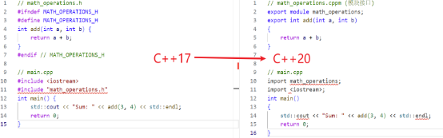

## **6.1模块**

模块是一个封装的代码单元，可以包含函数、类、变量等。模块通过接口文件定义其公共 API，其他代码可以通过导入模块来使用这些 API。

在C++20之前，使用头文件（#include）进行代码分割，容易出现头文件重复包含和编译速度慢等问题，尤其在大型项目中尤为明显。C++20引入模块后解决了很多问题。模块只用编译一次，不用像头文件一样需要反复编译，大大缩短了编译时间。模块中的某些修改不会触发该模块用户的重新编译。模块不受任何外部定义的宏的影响，并且在模块内部定义的任何宏对模块外部的任何代码都不可见。

模块的定义通常分为两个部分：模块接口和模块实现。

### **6.1.1模块接口：**

模块需要显式地声明要导出的内容。使用export关键字从模块中导出实体，没有从模块中导出的内容，只在该模块中可见。所有导出实体的集合叫做接口。

模块接口文件，是为模块提供功能定义的接口。模块接口文件通常以.cppm为扩展名。模块接口以声明开头，声明该文件正在定义一个具有特定名称的模块。
```
 // math\_operations.cppm (模块接口)
 export module math\_operations;
 export int add(int a, int b)
 {
   return a + b;
 }
 export int subtract(int a, int b)
 {
    return a - b;
 }
```
### **6.1.2模块实现：**

一个模块被分为一个模块接口文件和一个或多个模块实现文件。模块实现文件通常以.cpp为扩展名。关于模块的实现用户可以自主选择是放在模块接口文件中还是模块实现文件中。

模块实现文件中同样包含一个已命名模块的声明，用于指定实现所针对的模块，但不用加export关键字。
```
 // math\_operations.cpp (模块实现)*
 module math\_operations; *// 不需要 export*
 int multiply(int a, int b)
 {
return a \* b;
 }
 int divide(int a, int b)
 {
return a / b;
 }
```
### **6.1.3导入模块：**

如果想使用某个模块的功能，就需要导入这个模块。导入模块之后，可以直接使用模块定义的函数和类。通过import可以声明导入的模块，例如：
```
import <iostream>
 *// main.cpp
 #include math\_operations;
 #include <iostream>;
 int main()
 {
std::cout << "Sum: " << add(3, 4) << std::endl;
std::cout << "Difference: " << subtract(10, 5) << std::endl;
// multiply 和 divide 不可用，因为它们没有被 export
return 0;
 }
```
注意：C++20中某些可用的头文件不能保证是可导入的，为了安全，还是使用#include替换import声明。#include指令应该放在全局模块片段，必须出现在任何命名模块声明之前，以匿名模块的声明开始。

### **6.1.4模块的分割**

模块可以分为多个文件，使用import语句来引用其他模块。
```
 // math\_operations.cppm (模块接口)*
 export module math\_operations;
 export int add(int a, int b);
 export int subtract(int a, int b);
 // math\_operations\_impl.cpp (模块实现)*
 module math\_operations;
 int add(int a, int b)
 {
return a + b;
 }
 int subtract(int a, int b)
 {
return a - b;
 }
```
### **6.1.5预编译模块**

C++20还引入了预编译模块的概念，可以将模块编译成二进制格式，以加快后续的编译过程。

6\.1.6模块的优势

（1）减少编译时间：模块通过一次编译即可生成中间代码，后续只需引用模块的接口，而不必去重新解析整个头文件。

（2）避免命名冲突：模块使用独立的命名空间，避免了头文件中常见的命名冲突问题。

（3）简化依赖管理：使用模块可以减少编译器需要处理的依赖关系，从而提高编译效率。

6\.1.7模块与头文件的对比

下面的示例展示了如何使用模块与传统的头文件机制进行对比。

在这个例子中，`math\_operations.h` 是一个常规的头文件，其中定义了一个 `add` 函数。每次编译 `main.cpp` 时，编译器都要处理这个头文件。

对比说明：

① 模块接口文件 (.cppm): 在使用模块时，我们创建一个 `.cppm` 文件来定义模块接口。在文件中使用 `export` 关键字，表明哪些函数是外部可见的。

② 导入模块: 使用 import语句来引入模块，而不是使用 #include。这样做可以显著减少编译器处理的符号表。

③ 编译与链接: 使用模块的代码在编译时会生成一个一次性编译的模块文件，未来的编译会快速引用这个中间代码，而不需重新解析整个模块。