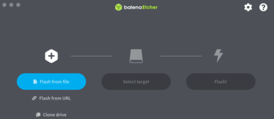
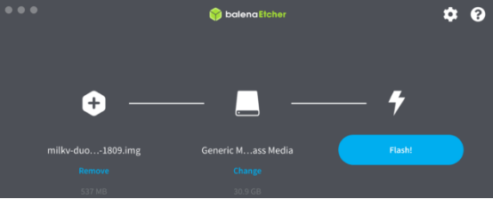

## 8.1 Duo（CV800B）的硬件架构与功能

Milk-V Duo 是一款基于 CV1800B 芯片的超紧凑型嵌入式开发平台。 它可以运行 Linux 和 RTOS，为专业人士、工业 ODM、AIoT 爱好者、DIY 爱好者和创作者提供可靠、低成本、高性能的平台。

### 8.1.1 CV1800B简介

CV1800B 是一款高性能、低功耗芯片，适用于住宅消费监控 IP 摄像机、家庭智能等众多产品，集成 H.264/H.265 视频压缩编码器和 ISP；支持数字宽动态、3D降噪、去雾、镜头畸变校正等图像增强和校正算法，为客户提供专业级的视频图像质量。

该芯片集成了自主研发的智能参考解决方案（人体检测、区域检测、运动检测），内置 DDR 以及完整的外围设备和外围设备，为支持客户产品开发和量产提供了高度集成且简单的解决方案。

### 8.1.2 CV1800B 上手指南

安装系统

从microSD卡启动

需要准备：

- Duo，Duo256M 或者 DuoS
- 大于 1GB 的 microSD 卡
- Type-C 数据线

下载镜像和工具：

下载链接：[https://github.com/milkv-duo/duo-buildroot-sdk/releases/](https://github.com/milkv-duo/duo-buildroot-sdk/releases/)

选择下图中的内容下载：

下载镜像烧录工具，例如[balenaEtcher](https://etcher.balena.io/) 或 [Rufus](https://rufus.ie/en/)。

烧录镜像：

下面是使用BalenaEtcher 烧录系统镜像的步骤。

如图所示，点击Flash from file

点击 Select target

点击Flash！

随后，使用5V适配器或者电脑USB，用Type-C线连接Duo。Duo上的蓝色灯闪烁，表明启动成功。

注意：如果开机后蓝色 LED 未闪烁，说明系统没有正常运行，可能是烧录到 microSD 中的镜像有问题。您可以尝试用其他烧录软件重新烧录镜像，常用的烧录软件有 balenaEtcher，Rufus，Win32DiskImager 等。
