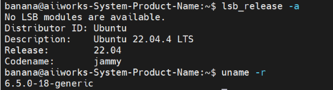
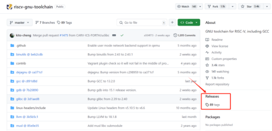
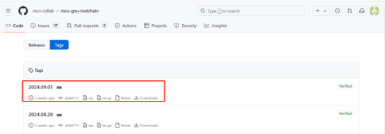
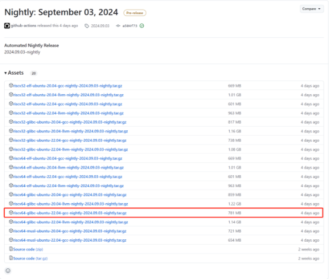
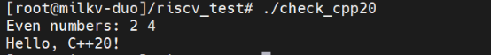

## <a name="_toc177736271"></a>**8.4 RISC-V、Duo与C++20**

前面我们讲到，Milk-V Duo是一款基于 CV1800B 芯片的超紧凑型嵌入式开发平台，基于RISC-V架构。下面我们将讲解如何在Duo上运行我们的C++20程序，这里将会讲解到新知识——交叉编译，包括交叉编译的概念、工具链的准备、环境搭建、编译的过程等等。

### <a name="_toc177736272"></a>**8.4.1 交叉编译是什么？**

简单的说，交叉编译就是在宿主机上将高级程序语言生成能够在目标机器上运行的可执行代码。也可以说交叉编译是指在一个操作系统或硬件架构（称为主机）上使用编译器生成适用于另一个操作系统或硬件架构（称为目标）的可执行文件。它的主要应用场景包括操作系统开发、多平台开发、嵌入式系统等，它具有高效率、高灵活性、节省资源的优点，但是环境的配置和调试的困难仍然是初学者需要面对和解决的。

交叉编译中包含两个概念，一个是体系结构（Architecture）一个是操作系统（Operating System）。同一个体系结构可以运行不同的操作系统；同一个操作系统也可以在不同的体系结构上运行。

交叉编译的必要性：

- 硬件限制：某些目标平台（如嵌入式设备）可能没有足够的资源来进行本地编译。
- 开发效率：在开发者的主机上编译可以加快开发速度，避免在目标设备上进行长时间的编译。
- 多平台支持：开发者可以为多个平台生成可执行文件，而不需要在每个平台上都进行编译。

  嵌入式系统开发时，运行程序的目标机器通常具有有限的存储空间和运算能力，然而，一般的编译工具链需要很大的存储空间，并需要很强的额CPU运算能力，为了解决这种问题就出现了交叉编译工具链，目前大多数交叉编译工具链都是在linux系统上运行的，这也取决于linux系统强大的功能和系统的稳定性。

### <a name="_toc177736273"></a>**8.4.2 交叉编译使用的工具链**

（1） 软件基础环境：


（2） 下载、安装和编译相关工具链

1. 链接：[https://github.com/riscv/riscv-gnu-toolchain](https://github.com/riscv/riscv-gnu-toolchain)
2. 下载下图所示的压缩包：



1. 点击



1. 下载

使用命令：
```
wget https://github.com/riscv-collab/riscv-gnu-toolchain/releases/download/2024.09.03/riscv64-glibc-ubuntu-22.04-gcc-nightly-2024.09.03-nightly.tar.gz
```


1. 解压：
```
tar -xzf riscv64-glibc-ubuntu-22.04-gcc-nightly-2024.09.03-nightly.tar.gz
```
1. 添加环境变量：

使用命令：sudo nano ~/.bashrc

验证：
```
banana@aiiworks-System-Product-Name:~$ echo $PATH

/usr/local/sbin:/usr/local/bin:/usr/sbin:/usr/bin:/sbin:/bin:/usr/games:/usr/local/games:/snap/bin:/home/banana/tool/riscv/bin
```
### <a name="_toc177736274"></a>**8.4.3 交叉编译的步骤**

假设你正在开发一个应用程序，目标是让它在Milk-V Duo（基于RISC-V架构的设备）上运行，但你在一台 x86 架构的 PC 上进行开发。你可以使用交叉编译工具链（如 gcc 的交叉编译版本）来编译你的代码，使其能够在 Milk-V Duo 上运行。

示例步骤：

安装交叉编译工具链：在你的 PC 上安装适合 Milk-V Duo（RISC-V架构） 的交叉编译工具链，例如 riscv64-unknown-linux-gnu。

编写代码：下面编写一个C++20代码，使用了C++20中的std::ranges和std::format，同样也可以检测我们的环境是否真正的支持C++20。
```
#include <iostream>

#include <vector>

#include <ranges>

#include <format>

int main() {

// 检查 std::ranges

std::vector<int> numbers = {1, 2, 3, 4, 5};

auto even\_numbers = numbers | std::views::filter([](int n) { return n % 2 == 0; });

std::cout << "Even numbers: ";

for (int n : even\_numbers) {

std::cout << n << " ";

}

std::cout << std::endl;

// 检查 std::format

std::string formatted = std::format("Hello, {}!", "C++20");

std::cout << formatted << std::endl;

return 0;

}
```
使用交叉编译器编译代码：
```
riscv64-unknown-linux-gnu-g++ -static -std=c++20 -o check\_cpp20 check\_cpp20.cpp
```
这一段命令中riscv64-unknown-linux-gnu-g++：

是一个交叉编译器，专门用于将C++代码编译为适用于RISC-V架构（64位）的Linux操作系统的可执行文件。g++是GNU C++编译器的名称。
```
-static：
```
这个选项指示编译器生成一个静态链接的可执行文件。静态链接意味着所有需要的库都将被包含在最终的可执行文件中，而不是在运行时动态链接。这使得生成的可执行文件在没有依赖库的情况下也能运行，但文件大小会增大。
```
-std=c++20：
```
这个选项指定使用C++20标准进行编译。C++20是C++语言的一个版本，包含了许多新特性和改进，如范围（ranges）、概念（concepts）、协程（coroutines）等。
```
-o check\_cpp20：
```
这个选项指定输出文件的名称。在这个例子中，编译器将生成一个名为check\_cpp20的可执行文件。
```
check\_cpp20.cpp：
```
这是要编译的源代码文件的名称。编译器将读取这个文件并生成可执行文件。

将生成的可执行文件传输到 Milk-V Duo：使用 scp 或其他文件传输工具将 hello 文件传输到 Milk-V Duo。

在 Milk-V Duo上运行：
```
./ check\_cpp20
```
通过以上步骤，你就可以在 x86 PC 上编写和编译代码，并在 Milk-V Duo 上运行它。这就是交叉编译的基本概念和实际应用。

下面是运行结果，很明显我们配置的工具链是成功的：

